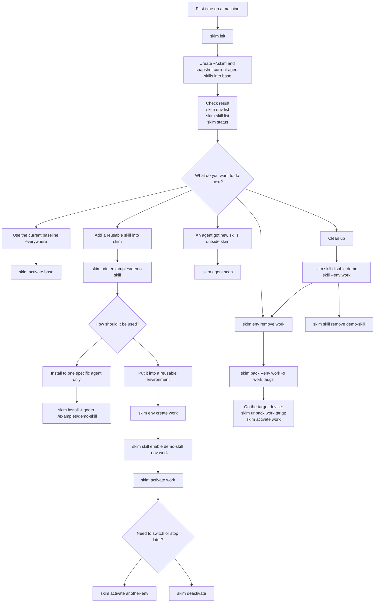

# skim

Skill Version Manager for coding agents. Manage and switch skills across multiple AI coding assistant frameworks with environment-based isolation.

## Features

- **Multi-Agent Support** — Works with Claude, Codex, Gemini, Qoder, and QoderWork
- **Global Skill Store** — Centralized skill management with easy import/export
- **Environment Switching** — Create isolated skill sets and switch between them instantly
- **One-Command Deploy** — Activate an environment to deploy skills to all agents at once
- **Portable Packs** — Export and import skim skills and environments across devices

## Installation

```bash
go install github.com/FanBB2333/skim/cmd/skim@latest
```

Or build from source:

```bash
make build
make install
```

## Quick Start

```bash
# Initialize skim
skim init

# See the base environment snapshot created from current agents
skim env list

# Add the bundled example skill to the global store
skim add ./examples/demo-skill

# Install the bundled example skill to a specific agent
skim install -t qoder ./examples/demo-skill

# Create an environment
skim env create work

# Enable skills in the environment
skim skill enable demo-skill --env work

# Activate the environment (deploys to all agents)
skim activate work
```

## Recommended Usage Flow



### Practical Order of Use

1. **First-time setup**
   Run `skim init` first. This creates `~/.skim`, imports the skills currently visible in your agents into the global store, and creates a `base` environment snapshot.

2. **Verify what skim currently knows**
   Use `skim env list`, `skim skill list`, `skim agent list`, and `skim status` right after `init` or after any big change.

3. **Add new skills to skim**
   Use `skim add <path>` when you want a skill stored centrally in the global store.
   `skim skill add <path>` is the store-oriented subcommand form, but `skim add <path>` is the shorter recommended entrypoint for daily use.

4. **Install to only one agent**
   Use `skim install -t <agent> <path>` when you want to add a skill to the store and immediately install it to one specific framework, such as Qoder, without touching other agents.

5. **Build reusable environments**
   Use `skim env create <name>` to create an environment, then `skim skill enable <skill> --env <name>` to add skills into it.
   This is the normal path when a skill should be reused across multiple agents or switched on and off as a group.

6. **Deploy an environment**
   Use `skim activate <env>` when the environment is ready. This deploys that environment's skills to all enabled and available agents.
   Use `skim deactivate` when you want to remove the currently managed deployment.

7. **Import external changes later**
   Use `skim agent scan` when someone added skills directly into an agent outside skim after your initial setup and you want skim to re-import them into the store.

8. **Move an environment to another device**
   Use `skim pack --env <name> -o <file.tar.gz>` to export one environment and the skills it references. On the target device, run `skim unpack <file.tar.gz>`, then `skim activate <name>`.
   `pack` dereferences symlinked files and directories inside skills, so the archive does not point back to paths on the source machine.

9. **Clean up**
   Use `skim skill disable <skill> --env <env>` to remove a skill from an environment, `skim env remove <env>` to delete an environment, and `skim skill remove <skill>` to delete a skill from the store when you no longer want to manage it.

### Typical Scenarios

- **I just installed skim**: `skim init` -> `skim env list` -> `skim activate base`
- **I created a new skill and want skim to manage it**: `skim add ./path-to-skill` -> `skim env create work` -> `skim skill enable <name> --env work` -> `skim activate work`
- **I only want one agent to get a skill right now**: `skim install -t qoder ./path-to-skill`
- **I manually changed agent skills outside skim**: `skim agent scan`
- **I want to stop using the current environment**: `skim deactivate`

## Commands

| Command | Description |
|---------|-------------|
| `skim status` | Show current status |
| `skim init` | Initialize skim configuration |
| `skim add <path>` | Add a skill from local path to the global store |
| `skim install -t <agent> <path>` | Add to the store and install to one target agent |
| `skim pack [-o <file>] [--env <env>]` | Export skills and environments to a portable archive |
| `skim unpack <archive> [--force]` | Import a skim pack archive |
| `skim env list` | List all environments |
| `skim env create <name>` | Create a new environment |
| `skim env remove <name>` | Remove an environment |
| `skim activate <env>` | Activate an environment |
| `skim deactivate` | Deactivate current environment |
| `skim skill list` | List skills in the global store |
| `skim skill add <path>` | Add a skill from local path |
| `skim skill remove <name>` | Remove a skill from the store |
| `skim skill enable <name>` | Enable a skill in an environment |
| `skim skill disable <name>` | Disable a skill in an environment |
| `skim agent list` | List supported agents and status |
| `skim agent scan` | Import existing skills to the store |
| `skim completion` | Generate shell completion scripts |

## Documentation

See [docs/](docs/) for detailed documentation:

- [Getting Started](docs/getting-started.md)
- [Concepts](docs/concepts.md)
- [Configuration](docs/configuration.md)
- [Command Reference](docs/commands.md)

## License

MIT
